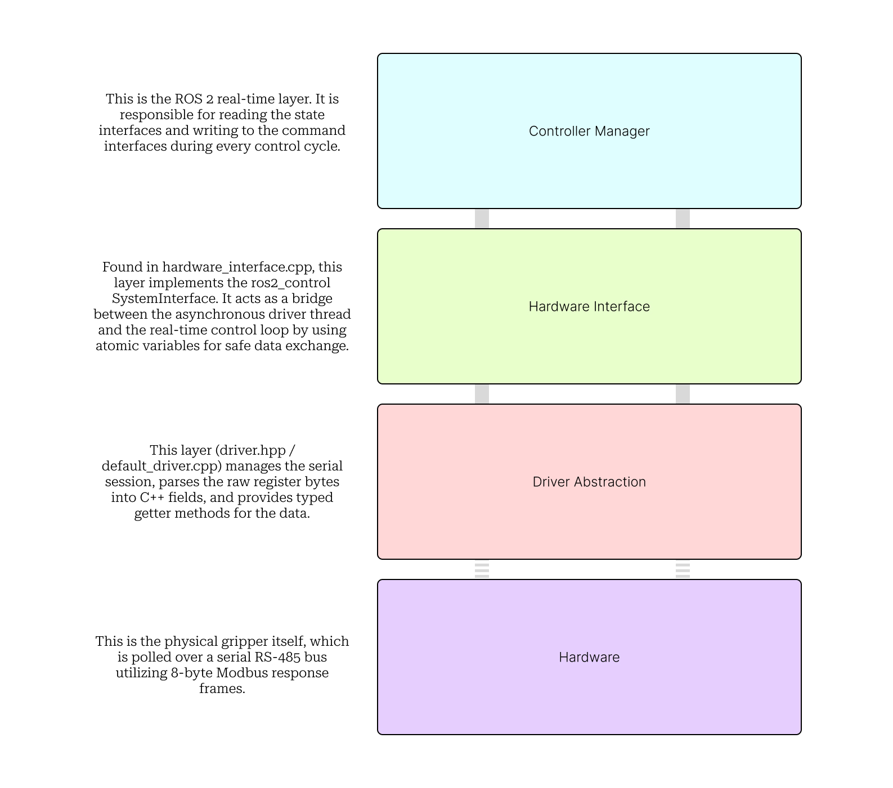
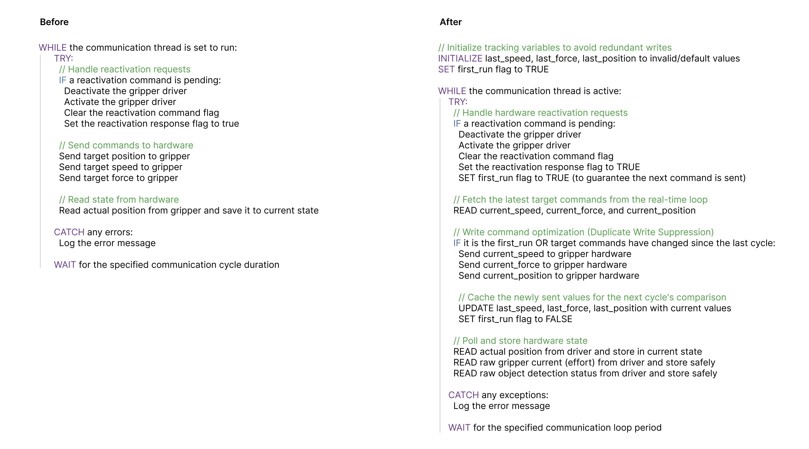
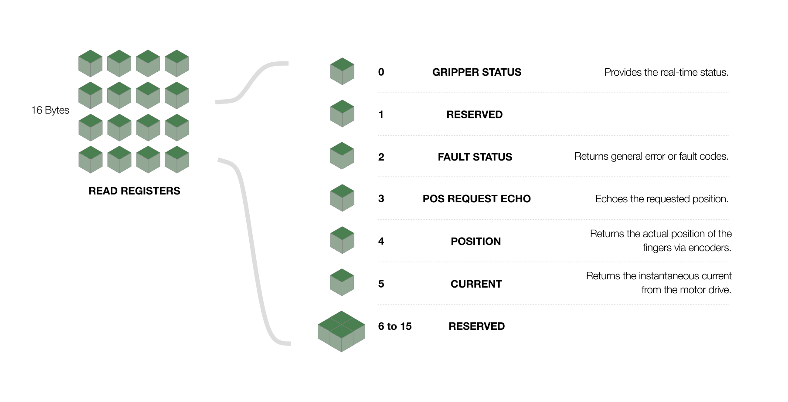
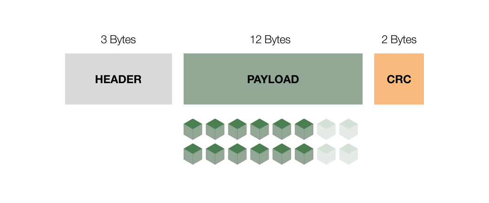

# Robotiq Driver — Modification Reference
### Extended State Feedback: Effort Reporting & Object Detection
`ros2_control` · `Modbus RTU` · `ROS 2 Humble/Iron`

---



---

## Table of Contents

1. [Motivation & Goals](#1-motivation--goals)
2. [Architecture Overview](#2-architecture-overview)
3. [File-by-File Modifications](#3-file-by-file-modifications)
   - [3.1 driver.hpp](#31-includerobotiq_driverdriverhpp)
   - [3.2 default_driver.hpp](#32-includerobotiq_driverdefault_driverhpp)
   - [3.3 fake_driver.hpp](#33-includerobotiq_driverfakefake_driverhpp)
   - [3.4 hardware_interface.hpp](#34-includerobotiq_driverhardware_interfacehpp)
   - [3.5 default_driver.cpp](#35-srcdefault_drivercpp)
   - [3.6 fake_driver.cpp](#36-srcfakefake_drivercpp)
   - [3.7 hardware_interface.cpp](#37-srchardware_interfacecpp)
4. [URDF / ros2_control Configuration](#4-urdf--ros2_control-configuration)
5. [Testing Guidance](#5-testing-guidance)
6. [Change Summary Table](#6-change-summary-table)

---

## 1. Motivation & Goals

The standard Robotiq driver exposed only **position** and **velocity** state to the ROS 2 controller ecosystem. Real-world manipulation tasks — object pick-and-place, force-sensitive assembly, bin-picking — require richer feedback to make informed decisions at the controller level.

This document describes a focused extension that surfaces two new pieces of gripper state all the way from raw Modbus registers up to the `ros2_control` real-time loop:

- **Gripper Current (Effort)** — a scaled representation of the force the gripper is exerting, derived from the motor current draw reported in hardware register byte 5.
- **Object Detection Status** — a discrete status code emitted by the gripper firmware indicating whether an object has been grasped, was missed, or the fingers are still moving.

> **Why does this matter?**
> Without effort feedback, a controller cannot distinguish a fully-closed empty gripper from one securely holding a part. Without object-detection status, pick-and-place sequences must rely on blind timeouts rather than reliable grasp confirmation.

In addition to the new state channels, a **serial-traffic optimization** was introduced: Modbus write commands are now suppressed when the target speed, force, and position values have not changed since the previous cycle. This reduces unnecessary bus contention and leaves more bandwidth for the status polling that the new state fields depend on.



---

## 2. Architecture Overview

The driver is structured as a layered pipeline. The diagram below shows how each layer relates to the others and where the new state fields are introduced.


The four layers from bottom to top:

- **Hardware (Modbus RTU)** — the physical gripper, polled over a serial RS-485 bus using 8-byte Modbus response frames.
- **Driver abstraction** (`driver.hpp` / `default_driver.cpp`) — owns the serial session; parses register bytes into C++ fields; exposes typed getter methods.
- **Hardware Interface** (`hardware_interface.cpp`) — implements `ros2_control` `SystemInterface`; bridges the asynchronous driver thread and the real-time control loop using atomics.
- **Controller Manager** — the ROS 2 real-time layer that reads state interfaces and writes command interfaces on every control cycle.

### 2.1 Data Flow — New State Fields

| Layer | Field (Current) | Field (Object Detection) |
|---|---|---|
| Modbus register | Byte 5 of response payload (`uint8` 0–255) | Bits 6 & 7 of byte 0 (`uint8`) |
| `default_driver.cpp` | `gripper_current_` (`uint8`) | `object_detection_status_` (`uint8`) |
| `hardware_interface.hpp` | `gripper_current_raw_` (`atomic<uint8>`) | `object_detection_status_raw_` (`atomic<uint8>`) |
| `hardware_interface.hpp` | `gripper_current_` (`double`) | `object_detection_state_` (`double`) |
| Exported interface name | `HW_IF_EFFORT` | `"object_detection_status"` |

---

## 3. File-by-File Modifications

The following sections describe every modified file, the precise reason each change was made, and the expected runtime effect.

---

### 3.1 `include/robotiq_driver/driver.hpp`

**Role:** Abstract base class defining the contract between the rest of the system and any concrete hardware or simulation backend.

#### What changed

- Added pure virtual method: `virtual uint8_t get_gripper_current() = 0;`
- Added pure virtual method: `virtual uint8_t get_object_detection_status() = 0;`

#### Why

Declaring both methods as pure virtual ensures that every implementation — real hardware, fake/simulation, and any future mock — must supply a concrete implementation. The compiler enforces the contract at build time; there is no runtime fallback path that can silently return stale or zero data.

> **Design note:** Returning `uint8_t` (0–255) keeps the getter at the raw hardware representation. Unit conversion and scaling is deliberately deferred to the `hardware_interface` layer, which owns the physical meaning of those bytes.



---

### 3.2 `include/robotiq_driver/default_driver.hpp`

**Role:** Header for the concrete Modbus RTU driver that talks to real hardware.

#### What changed

- Declared concrete overrides for `get_gripper_current()` and `get_object_detection_status()`.
- Added private member variable `gripper_current_` (`uint8_t`) to cache the most recently parsed current register value between polling cycles.
- Confirmed and fully documented `object_detection_status_` (partially pre-existing but now fully integrated into the polling cycle).

#### Why

Caching the last read value in a member variable decouples the polling rate from the getter call rate. The hardware interface's real-time loop may call `get_gripper_current()` many more times per second than the serial bus can be polled — caching ensures the loop always receives the most recent valid reading without triggering an additional Modbus transaction.

---

### 3.3 `include/robotiq_driver/fake/fake_driver.hpp`

**Role:** Header for the simulation / mock driver used in software-in-the-loop testing and CI environments where no physical gripper is present.

#### What changed

- Declared overrides for `get_gripper_current()` and `get_object_detection_status()` to satisfy the pure-virtual contract in `driver.hpp`.

#### Why

Without these declarations the fake driver would be an abstract class and could not be instantiated. Any CI pipeline or developer workstation running `mock_hardware` mode would fail to compile.

> **Simulation behaviour:** Both stubs return `0`. This is intentional: a simulated gripper generates no motor current and should never trigger a spurious grasp-detected event. Controllers under test must work correctly when these fields read zero.

---

### 3.4 `include/robotiq_driver/hardware_interface.hpp`

**Role:** Declares the `ros2_control` `SystemInterface` binding — the translation layer between the C++ driver and the ROS 2 Controller Manager.

#### What changed

##### New state containers

Four new member variables were added to ferry data safely across the thread boundary between the asynchronous serial polling loop and the real-time ROS control cycle:

| Variable | Type | Purpose |
|---|---|---|
| `gripper_current_raw_` | `atomic<uint8_t>` | Written by the background polling thread; read by the real-time loop without locks. |
| `gripper_current_` | `double` | Scaled value (in Newtons or equivalent) computed in `read()` each cycle. |
| `object_detection_status_raw_` | `atomic<uint8_t>` | Written by background thread when the firmware status register is polled. |
| `object_detection_state_` | `double` | Stable double exposed to controllers via the named state interface. |
| `last_gripper_position_` | `double` | Stores position from the previous `read()` call, required for the discrete velocity derivative. |

##### API modernisation — `on_init()` signature

The signature of `on_init()` was updated to accept `const hardware_interface::HardwareInfo& info` instead of the older `HardwareComponentInterfaceParams` type. This is a breaking change made to maintain compatibility with newer `ros2_control` releases (Humble / Iron). Without this change the package would fail to build against current ROS 2 distributions.

---

### 3.5 `src/default_driver.cpp`

**Role:** Core Modbus serial communication logic. This is where raw bytes from the gripper hardware are parsed into meaningful C++ state.

#### Modbus response frame structure

The Robotiq gripper responds to a status query with an 8-byte frame. The byte layout is:

| Byte 0 | Byte 1 | Byte 2 | Byte 3 | Byte 4 | **Byte 5 ★** |
|---|---|---|---|---|---|
| Gripper Status | Reserved | Fault Status | Position Request Echo | Position | **Current ★** |

> **★ New in this change:** `kCurrentIndex = 5` was added as a named constant. Payload byte 5 contains the motor current draw as a `uint8` (0 = no current, 255 = maximum rated current). Naming the constant prevents magic-number bugs if the frame layout is ever revisited.

#### What changed in `update_status()`

- On every polling cycle, byte 5 is now read and stored in `gripper_current_`.
- Object detection status parsing was already partially present but is now fully wired into the polling cycle.

#### New getter implementations

- `get_gripper_current()` returns the cached `gripper_current_` value.
- `get_object_detection_status()` returns the cached `object_detection_status_` value.



---

### 3.6 `src/fake/fake_driver.cpp`

**Role:** Simulation backend — used in CI and on developer machines without a physical gripper.

#### What changed

Stub implementations were provided for both new getters:

```cpp
uint8_t FakeDriver::get_gripper_current()          { return 0; }
uint8_t FakeDriver::get_object_detection_status()  { return 0; }
```

Both return `0`. This causes the hardware interface to report zero effort and a neutral detection status, which is the correct behaviour for a simulated gripper that has never physically contacted an object.

---

### 3.7 `src/hardware_interface.cpp`

**Role:** The central integration file — connects the C++ driver to the `ros2_control` ecosystem. This file contains the most substantial changes.

#### `export_state_interfaces()` — exposing new fields to controllers

Two new entries were added to the list of exported state interfaces, making the new data fields visible to any downstream ROS 2 controller:

| Interface name | Mapped C++ variable |
|---|---|
| `HW_IF_EFFORT` | `gripper_current_` (`double`) |
| `"object_detection_status"` | `object_detection_state_` (`double`) |

#### `on_init()` — URDF validation update

The validation logic that checks how many state interfaces each joint declares was extended to accept **2, 3, or 4** interfaces. Previously it accepted only 2 (position + velocity). The change prevents a startup assertion failure when the URDF now supplies the two additional state interfaces.

> **Upgrade note:** If you are loading this driver with an older URDF that still only declares 2 state interfaces (position + velocity) it will continue to work. The new interfaces are additive. Update the URDF when you are ready to consume effort and detection data from controllers.

#### `read()` — real-time data processing

The `read()` method is called on every `ros2_control` control cycle. Two new calculations were added:

- **Effort scaling:** The raw `uint8` current measurement (0–255) is mapped to a physically meaningful `double` using the maximum force configured for the gripper:

  ```cpp
  gripper_current_ = (gripper_current_raw_ / 255.0) * gripper_max_force_;
  ```

  This linear mapping yields a value in the same units as `gripper_max_force_` (typically Newtons). Controllers that consume the effort interface receive a value they can reason about directly without needing to know the raw ADC range.

- **Velocity calculation:** A proper discrete-time derivative replaced the prior approach:

  ```cpp
  gripper_velocity_ = (gripper_position_ - last_gripper_position_) / dt;
  ```

  `last_gripper_position_` is updated at the end of every `read()` call. `dt` is the elapsed time since the last cycle, derived from the ROS clock. This produces a stable velocity estimate regardless of control-loop jitter.


#### `background_task()` — asynchronous communication loop

This loop runs on a dedicated thread and is responsible for all serial I/O with the gripper hardware.

- **Duplicate write suppression (optimisation):** Before issuing a Modbus write command for speed, force, or position, the loop now compares the newly commanded values against the values sent in the previous cycle. A write is issued only when at least one value has changed. This can eliminate the majority of write traffic during steady-state operation (e.g. holding a grasp at constant force).

- **New atomic stores:** After each status poll, the freshly parsed current and detection values are written into `gripper_current_raw_` and `object_detection_status_raw_` respectively. Because these variables are `std::atomic` the real-time `read()` loop on the other thread can read them without locks, avoiding priority inversion.


---

## 4. URDF / ros2_control Configuration

To consume the new state interfaces from a controller, update the joint definition in your `ros2_control` URDF tag:

**Before (2 interfaces):**
```xml
<state_interface name="position"/>
<state_interface name="velocity"/>
```

**After (4 interfaces):**
```xml
<state_interface name="position"/>
<state_interface name="velocity"/>
<state_interface name="effort"/>
<state_interface name="object_detection_status"/>
```

The `on_init()` validation accepts 2, 3, or 4 state interfaces, so partial adoption (adding only `effort`, for example) is supported without needing to declare all four.

---

## 5. Testing Guidance

### 5.1 Simulation / mock hardware

Launch the driver with `mock_hardware: true` in your launch parameters. Both new getters will return `0`. Verify that:

- The controller manager starts without assertion errors.
- The `effort` and `object_detection_status` interfaces are listed when running `ros2 control list_hardware_interfaces`.
- No warnings appear about unexpected state interface counts.

### 5.2 Real hardware

With a physical gripper connected:

- Command the gripper to close on an object. Observe that the effort value rises above `0.0` and correlates with the commanded force parameter.
- Verify that `object_detection_status` transitions from `0` (moving) to the appropriate firmware code (`1` = outer object, `2` = inner object, `3` = no object / stall) on completion of the close command.
- Monitor Modbus traffic (e.g. with a serial analyser). Confirm that write commands are suppressed during steady-state hold and resume only when position/force/speed is commanded to change.


---

## 6. Change Summary Table

| File | Category | Key Change |
|---|---|---|
| `driver.hpp` | Interface | Added 2 pure virtual getters |
| `default_driver.hpp` | Interface | Declared overrides + `gripper_current_` cache |
| `fake_driver.hpp` | Interface | Declared overrides for stub implementation |
| `hardware_interface.hpp` | State / API | New atomic vars, `on_init()` signature update |
| `default_driver.cpp` | Parsing | `kCurrentIndex=5`, `update_status()` extended |
| `fake_driver.cpp` | Simulation | Stub implementations returning `0` |
| `hardware_interface.cpp` | Integration | Export interfaces, scale effort, velocity, atomic store, write suppression |
